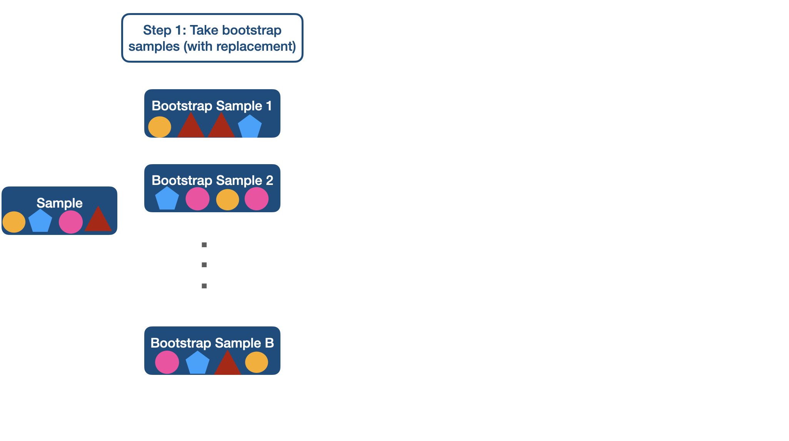
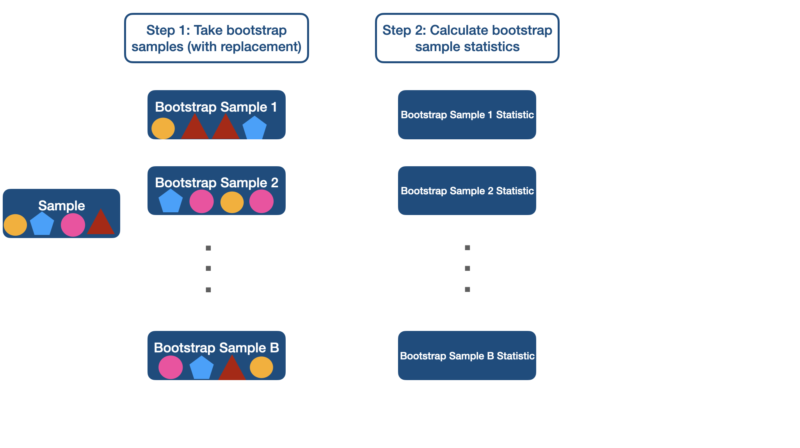
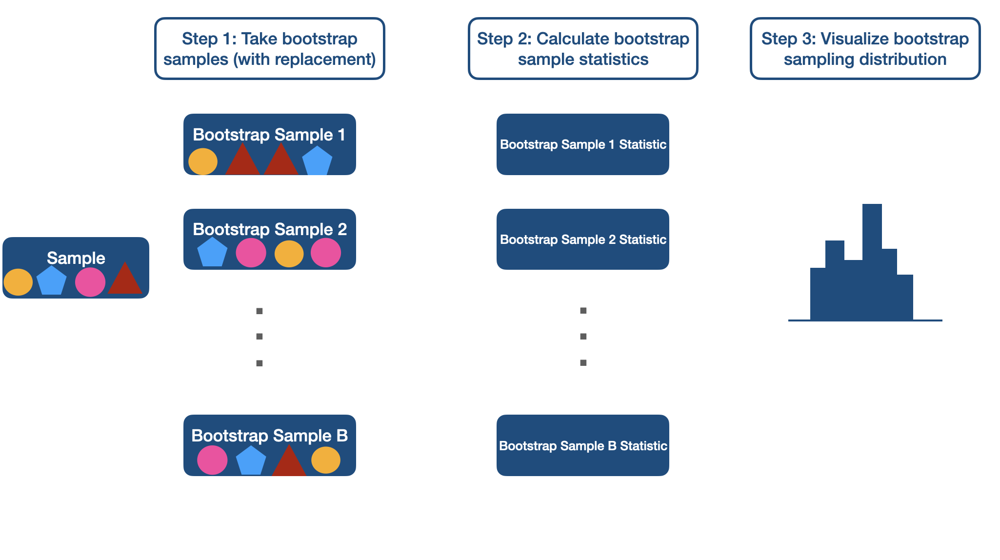

class: title-slide

```{r echo = FALSE, message=FALSE}
library(tidyverse)
library(infer)
options(scipen=999)

```


<br>
<br>
.pull-right[ 

# `r rmarkdown::metadata$title`
## `r rmarkdown::metadata$author`
]

---

## Data

```{r echo=FALSE, message=FALSE}
lapd <- read_csv(here::here("slides/data/Police_Payroll.csv"))
```


```{r message = FALSE, warning = FALSE}
lapd <- lapd %>% 
  janitor::clean_names() %>% 
  filter(year == 2018) %>% 
  select(base_pay)
```

--
We will be using payroll data from Los Angeles Police Department (LAPD) from 2018.


```{r echo = TRUE}
glimpse(lapd)   
```

---

## Population Distribution


```{r echo=FALSE,fig.align='center'}
lapd %>% 
  ggplot(aes(x = base_pay)) +
  geom_histogram(binwidth = 5000) +
  scale_x_continuous(labels = scales::comma_format()) +
  theme_bw() +
  theme(text = element_text(size = 20)) 
```

---

## True Median

```{r}
median(lapd$base_pay)
```
This is a **population parameter**. We often do not know population parameters but we can **estimate** them. Estimation requires some sample data.

---

### Sample 1


```{r echo=FALSE}
set.seed(12345)
sample_1 <- sample_n(lapd, 10)
sample_1$base_pay
```

Median of sample 1 is `r as.double(median(sample_1$base_pay))`.

--

### Sample 2


```{r echo=FALSE}

sample_2 <- sample_n(lapd, 10)
sample_2$base_pay
```

Median of sample 2 is `r as.double(median(sample_2$base_pay))`.

---

### Sample 3


```{r echo=FALSE}

sample_3 <- sample_n(lapd, 10)
sample_3$base_pay
```

Median of sample 3 is `r as.double(median(sample_3$base_pay))`.

--

### Sample 4


```{r echo=FALSE}
set.seed(12345)
sample_4 <- sample_n(lapd, 10)
sample_4$base_pay
```

Median of sample 4 is `r as.double(median(sample_4$base_pay))`.


---

## Sampling Variability

- Note that the median varies from sample to sample. Each sample's median is not necessarily the population median we are trying to estimate. There is variance of sample medians. 

--

- In real life taking samples from the population is costly. We often have only have one sample that we can use to estimate the population parameter.

--

- How can we take sampling variability into account when we only have one sample?

    - There are different ways to do this. We will use **bootstrapping** in this class.
    - You have done this using Central Limit Theorem in your introductory statistics courses. 

---

class: inverse middle

.pull-left[

<br>

.font75[Bootstrapping]

]

.pull-right[
```{r fig.align='center', echo=FALSE, out.width="40%"}

```
]
---


```{r fig.align='center', echo=FALSE, out.width="100%"}

```

---

```{r fig.align='center', echo=FALSE, out.width="100%"}

```

---

```{r fig.align='center', echo=FALSE, out.width="100%"}

```

---


```{r fig.align='center', echo=FALSE, out.width="100%"}

```

---

## Random Sample ( $n$ = 20)


```{r}
library(infer) # for bootstrap related functions
set.seed(12345)
lapd_sample <- sample_n(lapd, 20)

lapd_sample$base_pay
```


---

## Bootstrapping


```{r}
boot <- lapd_sample %>% 
  specify(response = base_pay) %>% 
  generate(reps = 1000, type = "bootstrap") %>% 
  calculate(stat = "median")
```

---

class: middle center 

<video width="80%" align = "center" controls>
  <source src="screencast/7-infer-bootstrap.mp4" type="video/mp4">
</video>
---

```{r fig.align="center",out.width="30%"}
visualize(boot) +
  scale_x_continuous(labels = scales::comma_format()) +
  theme_bw() +
  theme(text = element_text(size = 20)) 
```

---

## 95% Confidence Interval

We can construct the 95% confidence interval by calculating the 2.5th and 97.5th percentiles of the bootstrap distribution.

```{r}
boot %>% 
  summarize(lower_bound = quantile(stat, 0.025),
            upper_bound = quantile(stat, 0.975))
```

This confidence interval captures the true median (97600.66).

---

```{r echo = FALSE}
ci <-
  boot %>% 
  summarize(lower_bound = quantile(stat, 0.025),
            upper_bound = quantile(stat, 0.975))

lower_bound <- 
  boot %>% 
  summarize(lower_bound = quantile(stat, 0.025)) %>%
  pull()
upper_bound <- 
  boot %>% 
  summarize(upper_bound = quantile(stat, 0.975)) %>%
  pull()

```


## Interpretation of Confidence Intervals

.font50[`r fontawesome::fa("exclamation-triangle", fill = "black")`] Calculating a confidence interval does not guarantee that we will capture the true value of population parameter in the interval. 

--

If we were to take considerable large number of samples (we only had one sample) and construct 95% confidence intervals for each of the samples we would expect about 95% of the confidence intervals to capture the the true value of population parameter in the interval.


---

class: middle

## Reminders

- Sample statistics $\neq$ population parameter.

--

- Different samples can have different statistics, thus there is sampling variability.

--

- We have constructed a confidence interval to infer about a median but we could do this for mean, proportion, difference between two group means etc. 


